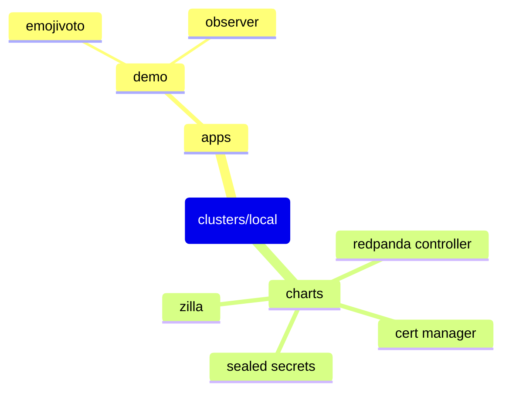

# Demo Cluster

Flux driven kubernetes cluster.



## Setup

### Flux

Used to **pull** repository changes into kubernetes clusters.

<https://fluxcd.io/>

### Brew

The Missing Package Manager for macOS (or Linux).

<https://brew.sh>

This repo includes a collection of dependencies to install:

```sh
brew bundle
```

### Pixie

Open source observability tool for Kubernetes applications. Uses eBPF to automatically capture telemetry data without the need for manual instrumentation.

<https://docs.px.dev/about-pixie/what-is-pixie/>

This takes advantage of some of the features of the linux kernel, and will not work in all Kubernetes environments. See [requirements](https://docs.px.dev/installing-pixie/requirements/).

### Redpanda

Kafka, but better.

<https://redpanda.com/>

### Minikube

Local Kubernetes.

<https://minikube.sigs.k8s.io/docs/>

[Redpanda's recommended setup](https://docs.redpanda.com/current/deploy/deployment-option/self-hosted/kubernetes/local-guide/?tab=tabs-2-minikube)

```sh
# DRIVER
# for linux, install https://minikube.sigs.k8s.io/docs/drivers/kvm2/
minikube config set driver kvm2
# for Intel Mac, install https://minikube.sigs.k8s.io/docs/drivers/hyperkit/
minikube config set driver hyperkit

minikube start --nodes 4 --network-plugin=cni --cni=false

kubectl taint node -l node-role.kubernetes.io/control-plane="" node-role.kubernetes.io/control-plane=:NoSchedule

cilium install --version 1.14.4
cilium status --wait

kubectl get pods -A
```

## Usage

### kubectl

<https://kubernetes.io/docs/reference/kubectl/cheatsheet/>

```sh
kubectl get GitRepository -n flux-system
kubectl get Kustomization -n flux-system
kubectl get HelmRelease -n blue
kubectl logs -n flux-system deploy/image-automation-controller

kubectl run curl --image=curlimages/curl --restart=Never --rm -it -- sh
kubectl run busybox --image=busybox --restart=Never --rm -it -- sh

kubectl port-forward -n emojivoto service/web-svc 3000:80
```

### flux

If you're setting up a cluster for the first time, it'll need to be [bootstrapped](https://fluxcd.io/flux/installation/bootstrap/github/). Make sure you have the `GITHUB_TOKEN` env set.

```sh
flux bootstrap github \
  --components-extra=image-reflector-controller,image-automation-controller \
  --token-auth \
  --owner=orbservability \
  --repository=demo-cluster \
  --branch=main \
  --path=clusters/overlays/local
```

<https://fluxcd.io/flux/cmd/>

```sh
flux get all -A

flux suspend image update my-service
flux resume image update my-service

flux reconcile source git flux-system
flux reconcile kustomization flux-system
flux reconcile kustomization charts
```

### kubeseal

<https://github.com/bitnami-labs/sealed-secrets>

```sh
encoded_auth=$(echo -n "user:token" | base64)
json_config=$(cat <<EOF
  {
    "auths": {
      "ghcr.io": {
        "auth": "$encoded_auth"
      }
    }
  }
EOF
)
encoded_config=$(echo -n "$json_config" | base64 -w 0)

kubeseal --format=yaml <<EOF
apiVersion: v1
kind: Secret
metadata:
  name: container-registry-auth
  namespace: orbservability
type: kubernetes.io/dockerconfigjson
data:
  .dockerconfigjson: $encoded_config
EOF
```

## Pertinent Sections

- [Apps](./apps)
- [Charts](./charts)
- [Clusters](./clusters)
- [Manifests](./manifests)
- [Notifications](./notifications)
